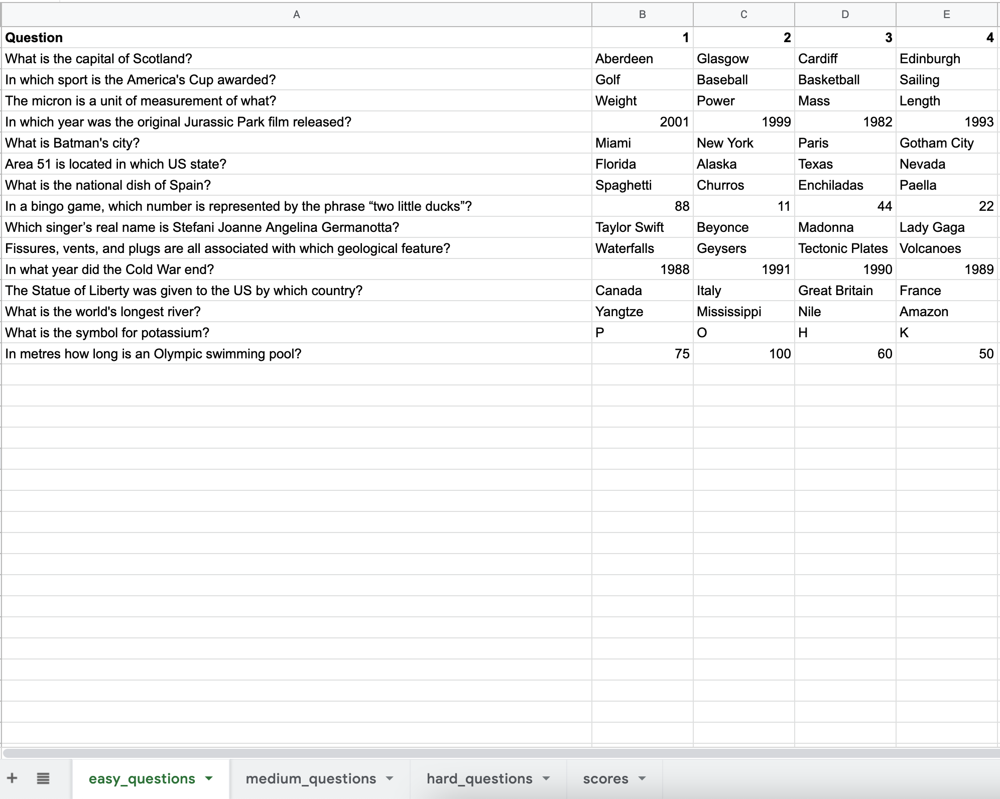

# CLI Who Wants To Be A Millionaire

CLI Who Wants To Be A Millionaire is a Python command line trivia game based on the TV show of the same name. 

## Design Process

### Game Design
- Here is the flowchart that I used to plan out the logic of the game to help me when writing the game code. 

 flow chart will go here

- The game consists of 15 general knowledge trivia questions. These questions get harder as the player progresses through the game.
- The questions are valued at progressively higher sums of money, up to the top prize of £1,000,000
- The objective of the game is to try and 'win' £1,000,000.
- For each question there are four options to choose from, labelled ‘A’, ‘B’, ‘C’ and ‘D’. 
- Two monetary milestones are provided. In this version of the game they are £50,000 (reached after successfully answering question 10) and £1,000 (reeached after successfully answering question 5)
- A player can 'walk away' from any question, with the last successfully answered question being the 'prize' they walk away with.

### User Storiess

- I would like to play a trivia game with questions of increasing difficulty.

- I would like to keep track of game scores by different players.

## Features
### Existing Features
- The game features 15 multiple choice questions.

	

- Input validation
	- If a user enters an invalid input like the letter 'n' instead of the letter 'b' the game will recognise this and ask the user to enter a correct input and inform them of the incorrect input they entered. 

	- This is defensive design and is a good UX practice. Every single input within the game will catch invalid inputs and allow the user to reinput.

		
- Score system
	- At the beginning of each game the player is asked to input their name. This is then used to populate a Google sheet with all of the different scores.
	- Within the game the user can input 'scores' from the main menu and be presented with a list of the 10 most recent scores, who achieved those scores and on what date.

		
- How to
	- The game feature a built in guide explaining the rules and objectives of the game.

		

- Connection to Google Worksheet
	- All of the game questions are stored in a Google worksheet made up of three sheets of questions.
	- The different sheets contain questions of different difficulty. There is an easy questions sheet, medium questions sheet, hard questions sheet.
	- The use of sheets in this way makes it very easy for additional questions to be added to the game, or out of date questions to be removed.
	- Here is a link to the [worksheet](https://docs.google.com/spreadsheets/d/1ubG6bOY5DT_VtNy0X7y1c0aIY2lo3iWI8ydAbElrlC0/edit?usp=sharing)

	

- Randomisation
	- To make the game more interesting when played multiple times it features two types of ranomisation:
	- The questions are randomly taken from each question sheet
	- The question answers are randomly assigned to the A,B,C,D letters

	

### Features Left to Implement

- Currently the game does not feature the game lifelines: 50:50, phone a friend or ask the audience. This is something I would like to add in the future.

- To make the game more engaging I would make use of the library Colorama to add coloured text into the game.

## Technologies Used

- Python - the game was coded in the Python programming language ans uses Python version 3
- Google Sheets - an online spreadsheet service my Google. This is used to store the game questions and player scores.
- Google Cloud
	- The Google Sheets API and Google Drive API are used in Google cloud to connect the project to my Google Drive/Sheets files
- Heroku a cloud platform-as-a-service is used to host the game in a web browser
- NODE.js a back-end JavaScript runtime is used to create a terminal in a web browser.  

## Tools used
- For writing code I used [Visual Studio Code](https://code.visualstudio.com/) which I also used for Git commands and pushing to GitHub. I ran the game in my local terminal inside Visual Studio Code.

- [GitHub](https://github.com]) was used for hosting the online repository, it provides an online version of Git, a source code management tool.

- [Markdown Editor](https://apps.apple.com/ie/app/markdown-editor/id1458220908?mt=12) by Satoshi Iwaki was used for editing .MD files.

## Testing

- For all testing, please refer to the [TESTING.md](TESTING.md) file.

## Deployment

Code Institute has provided a [template](https://github.com/Code-Institute-Org/python-essentials-template) to display the terminal view of this backend application in a modern web browser. This is to improve the accessibility of the project to others.

The live deployed application can be found at [cli-wants-to-be-a-millionaire](https://cli-wants-to-be-a-millionaire.herokuapp.com/).

### Local Deployment

*Gitpod* IDE was used to write the code for this project.

To make a local copy of this repository, you can clone the project by typing the follow into your IDE terminal:
- `git clone https://github.com/ancfoster/CLI-Who-Wants-To-Be-A-Millionaire.git`

Alternatively, if using Gitpod, you can click below to create your own workspace using this repository.

### Heroku Deployment

This project uses [Heroku](https://www.heroku.com), a platform as a service (PaaS) that enables developers to build, run, and operate applications entirely in the cloud.

Deployment steps are as follows, after account setup:

- Select *New* in the top-right corner of your Heroku Dashboard, and select *Create new app* from the dropdown menu.
- Your app name must be unique, and then choose a region closest to you (EU or USA), and finally, select *Create App*.
- From the new app *Settings*, click *Reveal Config Vars*, and set the value of KEY to `PORT`, and the value to `8000` then select *add*.
- Further down, to support dependencies, select *Add Buildpack*.
- The order of the buildpacks is important, select `Python` first, then `Node.js` second. (if they are not in this order, you can drag them to rearrange them)

Heroku needs two additional files in order to deploy properly.
- requirements.txt
- Procfile

You can install this project's requirements (where applicable) using: `pip3 install -r requirements.txt`. If you have your own packages that have been installed, then the requirements file needs updated using: `pip3 freeze --local > requirements.txt`

The Procfile can be created with the following command: `echo web: node index.js > Procfile`

For Heroku deployment, follow these steps to connect your GitHub repository to the newly created app:

- In the Terminal/CLI, connect to Heroku using this command: `heroku login -i`
- Set the remote for Heroku: `heroku git:remote -a <app_name>` (replace app_name with your app, without the angle-brackets)
- After performing the standard Git `add`, `commit`, and `push` to GitHub, you can now type: `git push heroku main`

The frontend terminal should now be connected and deployed to Heroku.

## Credits

- Code snippet from StackOverflow user [Alex Hawking](https://stackoverflow.com/users/9868018/alex-hawking) that is used to clear the terminal

- Code snippet from StackOverflow user [Antony](https://stackoverflow.com/users/1030576/anthony) that makes use of 'time.sleep()' to [improve CPU performance](https://stackoverflow.com/questions/13293269/how-would-i-stop-a-while-loop-after-n-amount-of-time) when using 'time.time()' in a loop.
- How to use a wildcard in Python match-case from StackOverflow user [Tomerikoo](https://stackoverflow.com/users/6045800/tomerikoo)

### Acknowledgements
 would like to thank my Code Institute mentor Tim Nelson for providing invaluable guidance during the development of this project. I also wish to thank my wife Alice for helping me by testing the game.