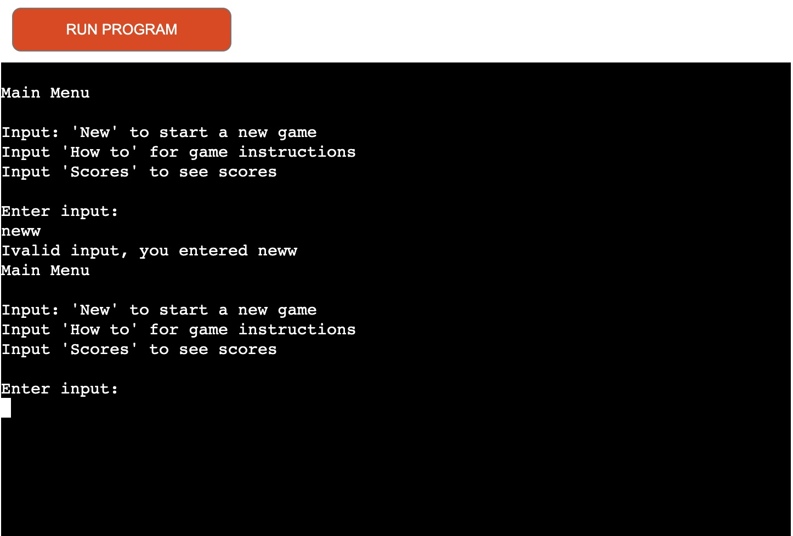
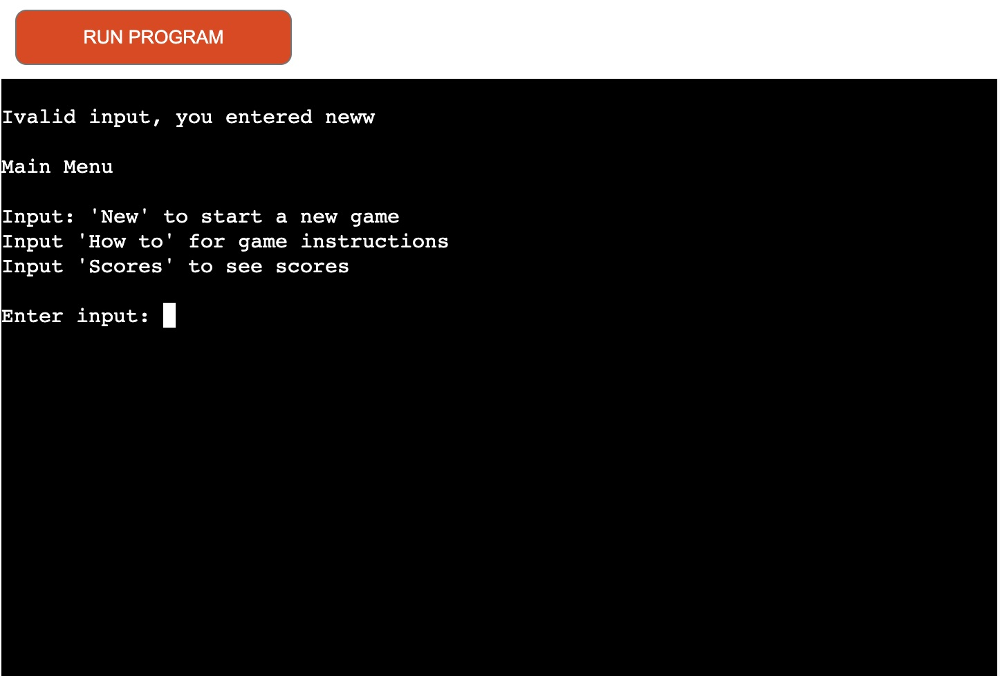
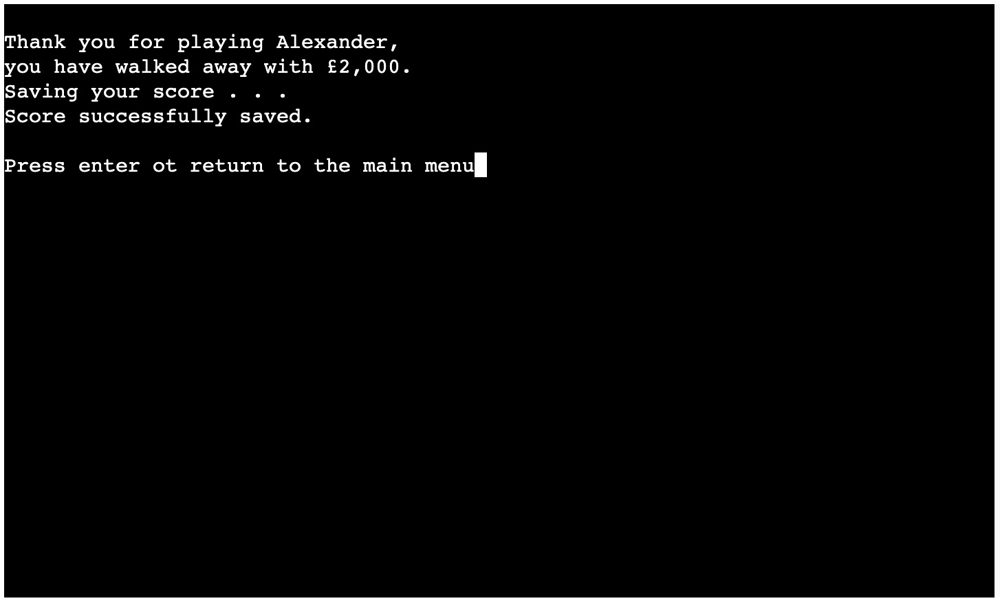
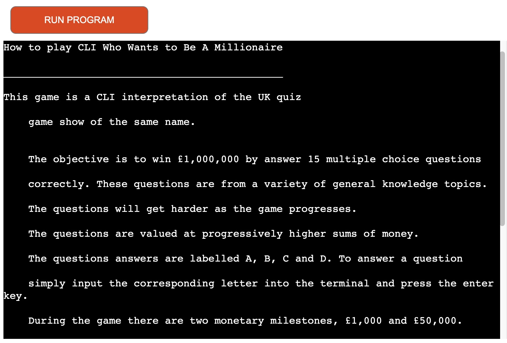
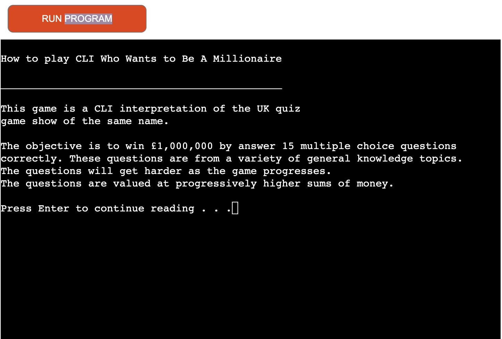
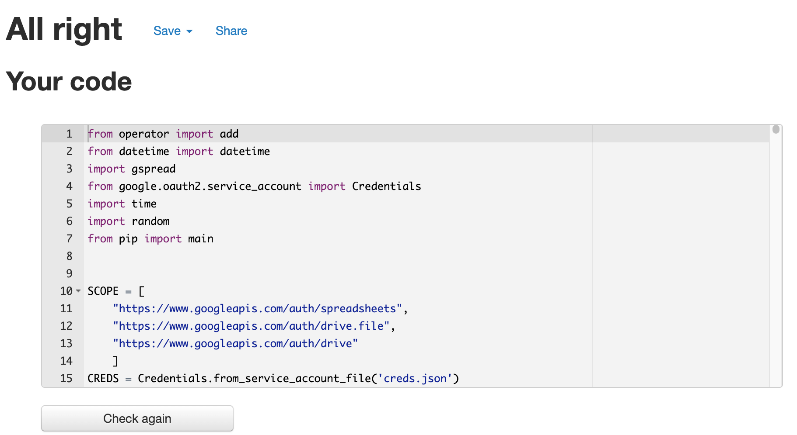
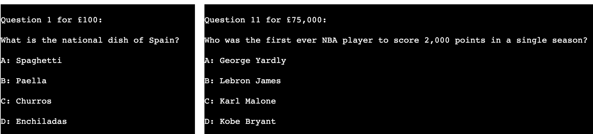
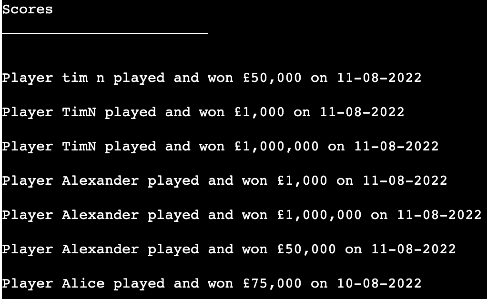

# Testing
Click here to return to [README.md](README.md)

## Changes made after user testing

During devleopment I sought user feedback from my mentor and another user. Based on their feedback the following changes were made.

- Removing of previous outputs when the user entered an invalid input.
	- If a user entered an invalid input, like the letter F instead of the letter D the game would output an error message along with their incorrect input. Now the game also removes the previously outputted question and options to keep the terminal output clean and readable.
	
		| Before | After |
		|---|---|
		|||

- Messages in the game such as game won/complete/walk away messages disappeared after a number of seconds. During testing this was found to result in a negative user experience, so now the messages remain on the user presses return on their keyboard.

	

- The 'How to Play' instruction section used to output all of its text in one go. During testing both of the users did not like this approach. Now sections of text are outputted individually with the user having to press enter in between sections.

	| Before | After |
	|---|---|
	|||

## Code Validation

**PEP8 validator**

The code passes through the PEP8 validator.

| File | Screenshot |
|---|---|
|run.py||

## User Story Testing

- I would like to play a trivia game with questions of increasing difficulty.

	

- I would like to keep track of game scores by different players.

	